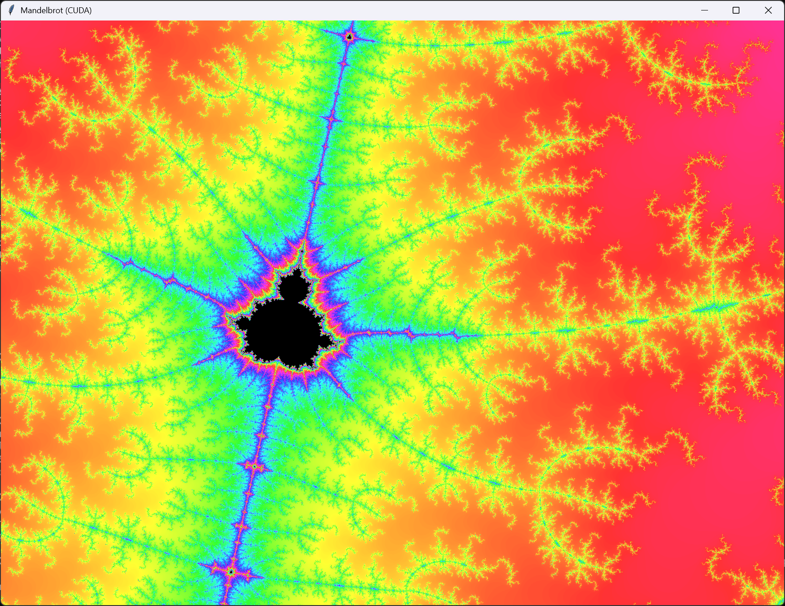

> [!NOTE]
>
> Of course, this Mandelbrot set explorer of mine is nothing new under the sun. :smiley:  
> Nevertheless, it's user-friendly and easy to use. ​It will tell you what Python packages and other SW components are missing and how to install them.  
> On a system with an NVIDIA GPU or an Intel integrated GPU, zooming in is pretty fast even with the application window maximized on a 4k screen. Enjoy!
>
> I didn't write the code. :wink: This was my teaching case on how to use the [Claude Code](https://github.com/anthropics/claude-code) agentic coding tool. However, significant work, countless prompts, rigorous testing, and general technical knowledge were required to produce an app I regard as of good quality. This was not a project for one afternoon. I'm proud to publish this even though I didn't write the code.

# Mandelbrot Set Explorer



An interactive desktop application for exploring the [Mandelbrot set](https://en.wikipedia.org/wiki/Mandelbrot_set) with real-time zoom and pan.

Built with Python and Tkinter, the app renders the Mandelbrot set in a resizable window and lets you dive into its infinite fractal detail. The application supports GPU-accelerated computation on NVIDIA GPUs via CUDA and on Intel integrated GPUs via OpenCL, as well as Numba JIT compilation for fast CPU rendering when a GPU is not available.

**Controls:**

| Action | Effect |
|---|---|
| Left click | Zoom in 5x |
| Shift + left click | Zoom in 2.5x |
| Right click | Zoom out 5x |
| Shift + right click | Zoom out 2.5x |
| Drag | Pan the view |
| H | Toggle help overlay |

The window title indicates the active compute backend (e.g., "Mandelbrot (**CUDA**)", "Mandelbrot (**Intel GPU**)", "Mandelbrot (**Numba JIT**)", or "Mandelbrot (**CPU**)").

While the image is being computed, a red "CALCULATING" label is displayed at the top center of the window.

A help overlay in the top-left corner of the window shows the available controls (press H to toggle it). 

## How to Run

Download [mandelbrot.py](mandelbrot.py).

```
python mandelbrot.py          # Windows
python3 mandelbrot.py         # Linux
```

**I tested the app on Python 3.12.3, on Windows and Ubuntu 24.04**. I tested the GPU computation on my NVIDIA GeForce RTX 4080 and three different Intel CPUs with integrated graphics.

> [!TIP]
>
> On startup, the script checks for missing required packages and prints platform-specific installation instructions if any are missing.
>

### Required packages

| Package | Notes |
|---|---|
| tkinter | GUI framework (included with Python on Windows; requires `python3-tk` on Linux) |
| Pillow | Image rendering |
| numpy | Numerical computation |
| mpmath | Arbitrary-precision arithmetic for deep zoom |

### Optional packages

| Package | Purpose |
|---|---|
| cupy-cuda13x | NVIDIA GPU acceleration via CUDA (float64)  <br />Requires CUDA 13 Runtime installed (see instructions below) |
| pyopencl | Intel integrated GPU acceleration via OpenCL (float32)  <br />On Linux also requires the `intel-opencl-icd` apt package |
| numba | JIT-compiled CPU computation with automatic parallelism (used when a GPU is not available) |
| gmpy2 | Accelerated arbitrary-precision arithmetic for deep zooms (C-based GMP/MPFR, replacing pure-Python mpmath) |

### Installation of the packages

**Windows (pip):**

```
pip install numpy Pillow mpmath gmpy2 numba cupy-cuda13x pyopencl
```

**Linux (apt for system packages, or pip in a virtual environment):**

```
sudo apt install python3-tk python3-numpy python3-pil python3-pil.imagetk python3-mpmath python3-gmpy2

# On Ubuntu 24.04 I wasn't able to correctly install the following packages
# using apt. The pip worked and didn't break my system (but be careful on yours!):
pip install numba cupy-cuda13x pyopencl --break-system-packages
```

Or in a virtual environment (tkinter still requires apt on Linux):

```
sudo apt install python3-tk
pip install numpy Pillow mpmath gmpy2 numba cupy-cuda13x pyopencl
```

> [!IMPORTANT]
>
> The **CUDA 13 Runtime libraries** are required for `cupy-cuda13x` for NVIDIA GPU acceleration to work.
>
> **On Windows**, install the CUDA 13 Runtime from the [CUDA Toolkit Downloads](https://developer.nvidia.com/cuda-downloads) page (the pip packages didn't work reliably for me on Windows). You don't need to install the full CUDA Toolkit. In the installer, select Custom Installation, then choose only the Runtime to be installed.
>
> **On Linux**, install them with pip:
>
> ```
> pip install nvidia-cuda-runtime nvidia-cuda-nvrtc
> ```
>

> [!IMPORTANT]
>
> **Intel OpenCL** **on Linux** requires the Intel OpenCL ICD loader (this is not needed on Windows):
>
> ```
> sudo apt install intel-opencl-icd
> ```

### Command-line options

| Option | Description |
|---|---|
| `--forcecpu` | Disable all GPU acceleration; forces CPU computation via Numba JIT (if the package is installed) or CPU multiprocessing |
| `--forceintel` | Disable CUDA but keep Intel OpenCL GPU if available |
| `-h`, `--help` | Show help message and exit |

`--forcecpu` takes precedence over `--forceintel` if both are specified.

## Interesting Technicalities

### Perturbation Theory

Standard float64 arithmetic limits sharp Mandelbrot rendering to about $`10^{-13}`$ zoom. Beyond this depth, the application uses [perturbation theory](https://en.wikipedia.org/wiki/Plotting_algorithms_for_the_Mandelbrot_set#Perturbation_theory_and_series_approximation): a single reference orbit is computed in arbitrary precision (via mpmath or gmpy2), and each pixel's iteration is expressed as a small float64 delta from that reference. This avoids the cost of full arbitrary-precision math for every pixel while maintaining sharp detail at extreme zoom levels. On the Intel OpenCL path (float32), perturbation kicks in much earlier (~$`10^{-5}`$ zoom) due to lower floating-point precision.

### GPU Acceleration

The application supports two GPU backends:

- **NVIDIA CUDA** (via CuPy) — uses float64 (double precision) kernels for maximum zoom depth. The CUDA kernels use a [warp](https://docs.nvidia.com/cuda/cuda-c-programming-guide/index.html#simt-architecture)-aligned block size of (32, 8) for optimal memory coalescing when threads access consecutive coordinate values.
- **Intel OpenCL** (via PyOpenCL) — uses float32 (single precision) kernels, targeting Intel integrated GPUs that typically lack float64 support.

The computation priority chain is: **CUDA > OpenCL > Numba JIT > ProcessPoolExecutor > single-threaded NumPy**.

### Numba JIT

When `numba` is installed and no GPU is active, the app uses `@njit(parallel=True)` with `prange` to compile the per-pixel Mandelbrot loop to native machine code. Numba handles its own thread-level parallelism internally, replacing both the NumPy vectorized masking approach and the `ProcessPoolExecutor` multiprocessing fallback.

### CPU Multithreading

When no GPU backend is active and Numba is not installed, the app uses `ProcessPoolExecutor` to split the image into horizontal strips distributed across all available CPU cores.

### gmpy2

At deep zoom, perturbation theory requires computing a single reference orbit in arbitrary precision. This is the only part of the calculation that uses arbitrary-precision arithmetic — all per-pixel iterations are done in fast float64 (or float32) deltas. When `gmpy2` is installed, it replaces pure-Python `mpmath` for this reference orbit computation, using the C-based GMP/MPFR libraries. The speed-up matters because the reference orbit grows longer at extreme zoom depths and its arbitrary-precision iteration becomes the bottleneck.
